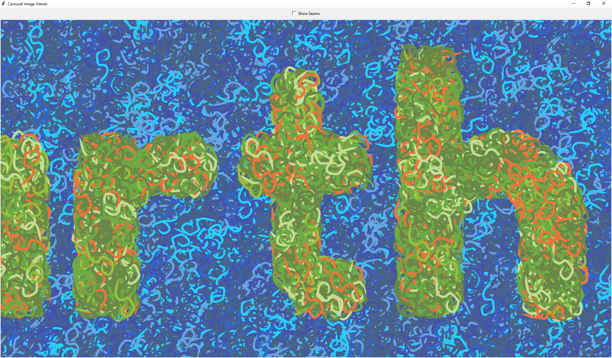

# carousel-image-viewer

Opens 3 images side-by-side (to test seamless-ness - for posting on Instagram, etc.)

> Carousel Image Viewer (subtlely) showing me I need to re-export my images correctly if I want them to be displayed properly on a carousel post on Instagram.

## Usage

1. Place the Python script `view.py` in a directory with your images e.g. `image1.png`, `image2.png`, and `image3.png`.
2. Run `python view.py` to open the Carousel Image Viewer

- Middle Mouse Button (MMB) to pan the images

## Credits

Developed entirely by me prompting ChatGPT (GPT-3.5).

## TODO

- [ ] FIX unresponsive "Show Seams" checkbox
- [ ] Mouse Wheel Scroll to zoom in/out - with Editable Text Box to edit Zoom as well
- [ ] `File > Open` - to open ~2-6 selected images (instead of hardcoding "image1.png", etc.)